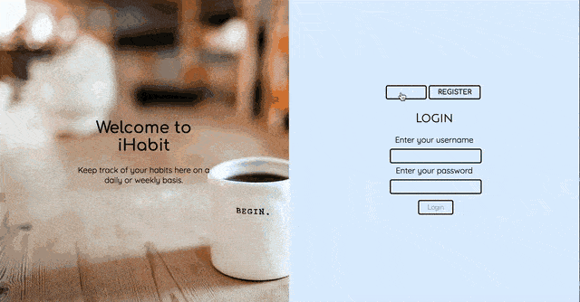

# iHabit

Keep track of your habits here on a daily or weekly basis. Keep up your streaks and reach your goals!

[Click here to go to the live demo!](https://ihabit.netlify.app)

## Installation

- First, `git clone` this repository
- To run the React client, `cd` in to clients folder and `npm install`
- `npm start` to launch React on `localhost://8080`

- To run the server, `cd` into server folder and `npm install`
- run `docker-compose up` to launch the express server at `localhost://3000`

## Technologies

- HTML, CSS, JavaScript, TDD: Jest/Enzyme, Nodemon, React, Postgres SQL, ChartJs, Docker, Netlify

## Wins and Challenges

- Users can register an account and login
- Users can choose a habit they want to track and choose the frequency
- Users can mark a habit as complete for the day
- Users can see their most recent completions
- CRUD - users can create, read, update (completion) and delete a habit

## Future Features

- Allow users to keep track of their habits with a visual calendar
- Social media integration so users can link iHabit to a chosen social media account

## Learning Curves

- Achieving above 60% test coverage

## Contributors

[@rajtandel21](https://github.com/rajtandel21), [@stephanie-ai](https://github.com/stephanie-ai), [@Tempestx4](https://github.com/Tempestx4) [@GeriNZ](https://github.com/GeriNZ), [@FopeA6](https://github.com/FopeA6)

## Licence

[MIT Licence](https://opensource.org/licenses/mit-license.php)
